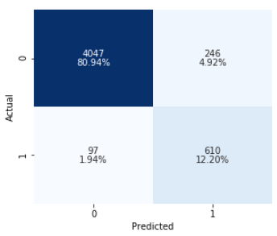

# Overview  

In this project I am working with data from the Churn dataset, which I got from [https://www.openml.org/](https://www.openml.org/).  
Here is a link to this dataset on their website:[https://www.openml.org/d/40701](https://www.openml.org/d/40701)  

It is an imbalanced dataset as can be seen in this graph:
  

I am trying to predict which customers will be leaving, in order to come up with a plan to retain them.  
Therefore I will be trying to optimize recall, while still trying to keep the number of false positives as low as possible. The metric that I will be using to evaluate that in the models is cost-benfit analysis.
   

## Findings

Here is the confusion matrix for the total dataset, on the best model I found:

The cost-benefit amount of this model is $310,720.  

This was calculated as follows:  
Average bill = $60  
24 Month contract brings in $1440  
Promotion worth = $500  
  
246 * Promotion: Loss  
97 * 24 month contract: Loss  
610 * (24 month contract – Promotion): Gain  
  
Gain - Loss total = cost-benefit amount  

## Recommendations

I would suggest offering a promotion to customers predicted as leaving to try and retain them.

## Future Work

1. Identify the best promotion amount to retain customers  
2. Identify the best promotions to offer: i.e discounted phone, discount on plan etc.
